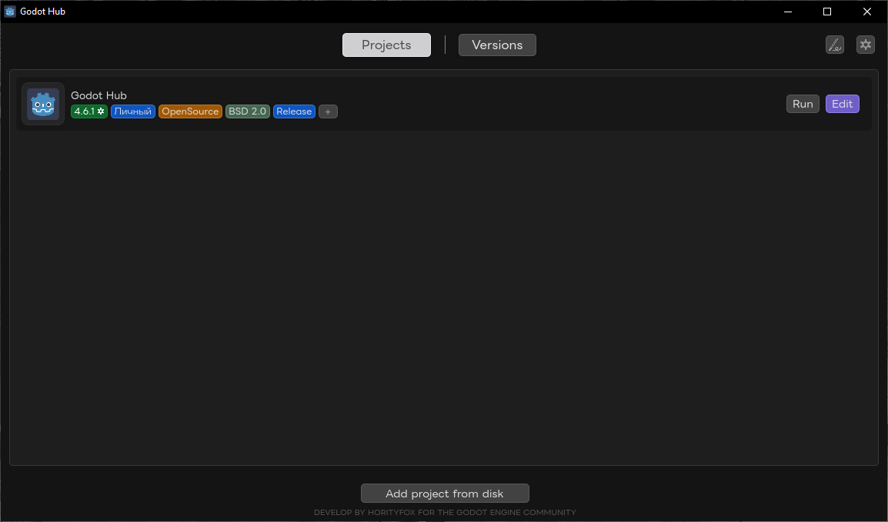
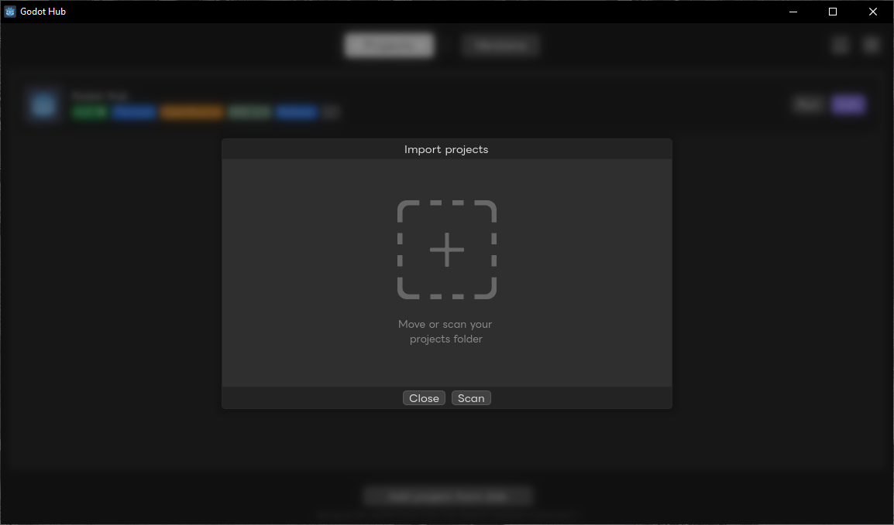
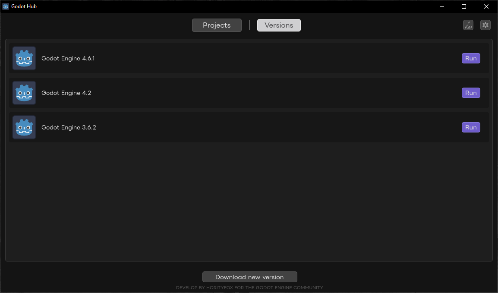
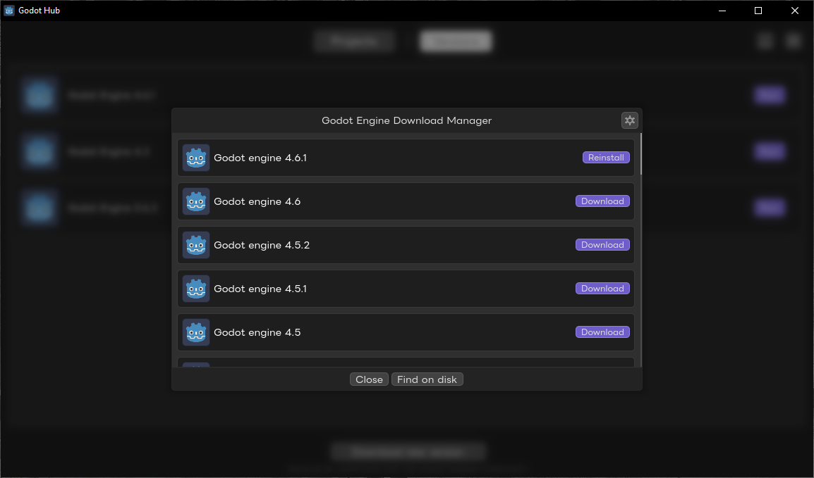
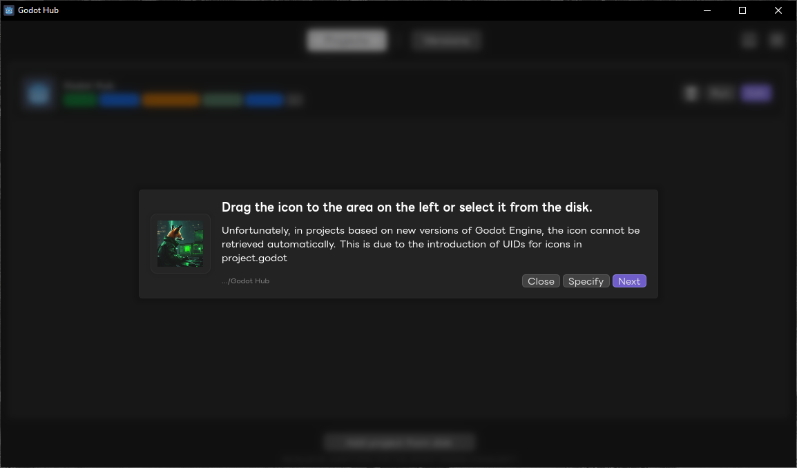
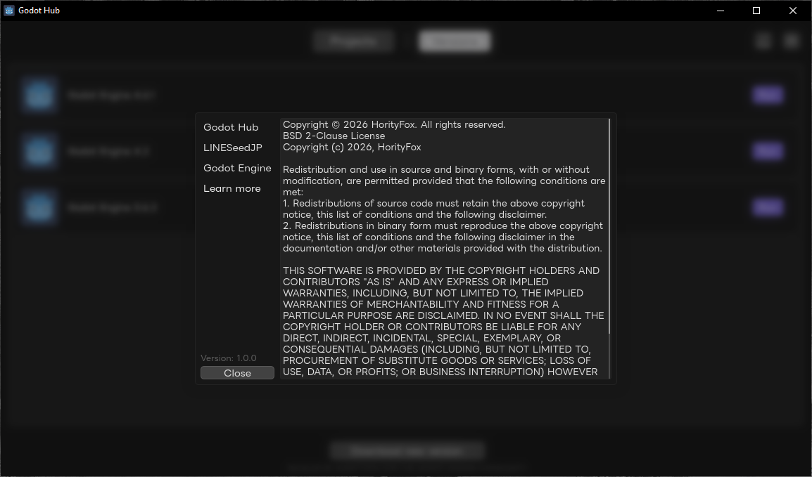

# Godot Hub 🚀

**Godot Hub** is a lightweight and intuitive tool designed for Godot Engine developers to manage multiple engine versions and projects efficiently. Focus on game logic, not version switching.

---

## 🛠 Key Features

### 📂 Project Management
Easily organize your workspace. The dashboard provides a clear overview of your current projects with status tags and custom icons.

### 📥 Effortless Import
Scan your local drives or drag and drop folders to add existing projects to the Hub in seconds.

### ⚙️ Version Control
Install and run different versions of the Godot Engine (from 3.x to 4.x) side by side. Each project stays tied to its compatible engine version.

### 🌐 Built-in Download Manager
Access the official Godot repository directly. Download, update, or reinstall any engine version with a single click. You can also update Godot Hub directly in the application settings without visiting GitHub when a new version is released.

---

## 💎 Technical Details

* **Icon Handling:** Supports manual icon assignment for newer Godot versions where UID-based icons cannot be retrieved automatically.
* **Performance:** Optimized for low resource consumption.
* **Architecture:** Clean, modular design built for extensibility.

---

## 📄 License & Credits

Developed by **HorityFox** for the Godot Engine Community.
Licensed under the **BSD 2-Clause License**.

---
*Stay creative. Happy coding!* 🌿🌚